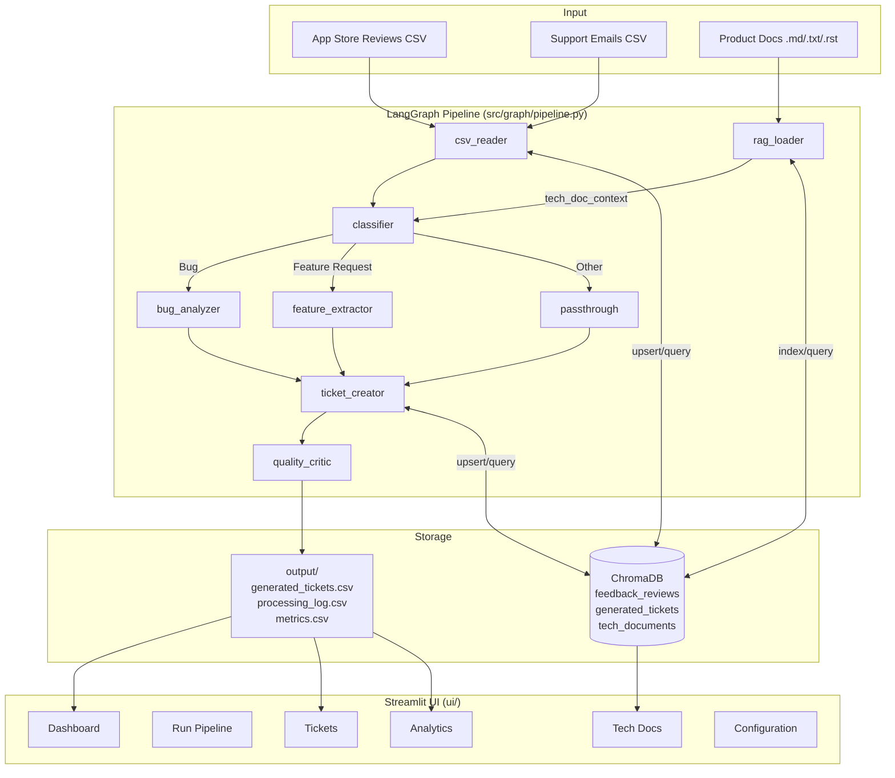
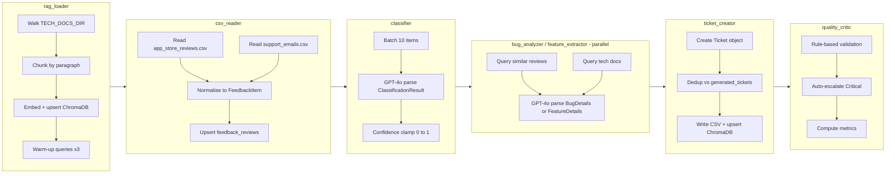
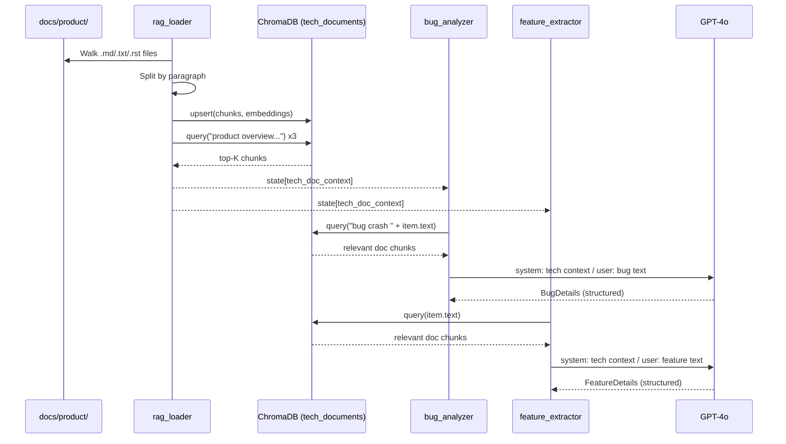
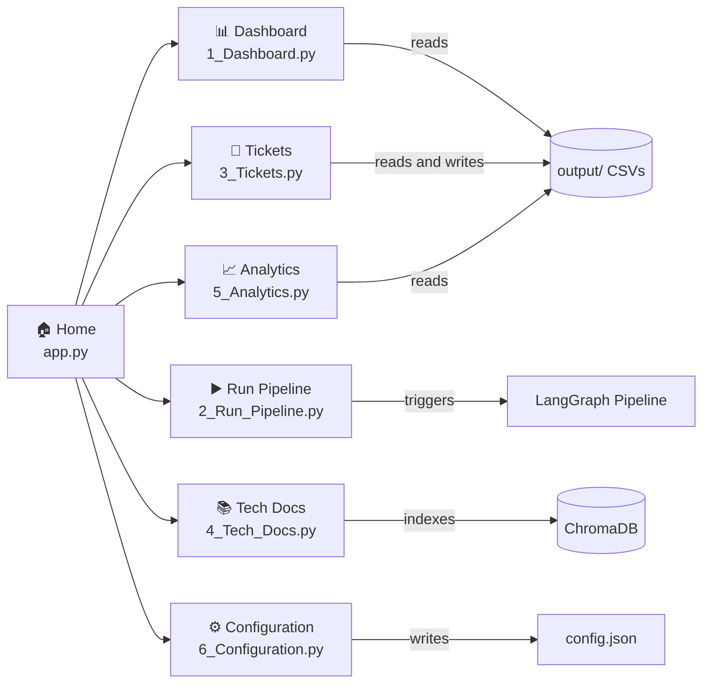
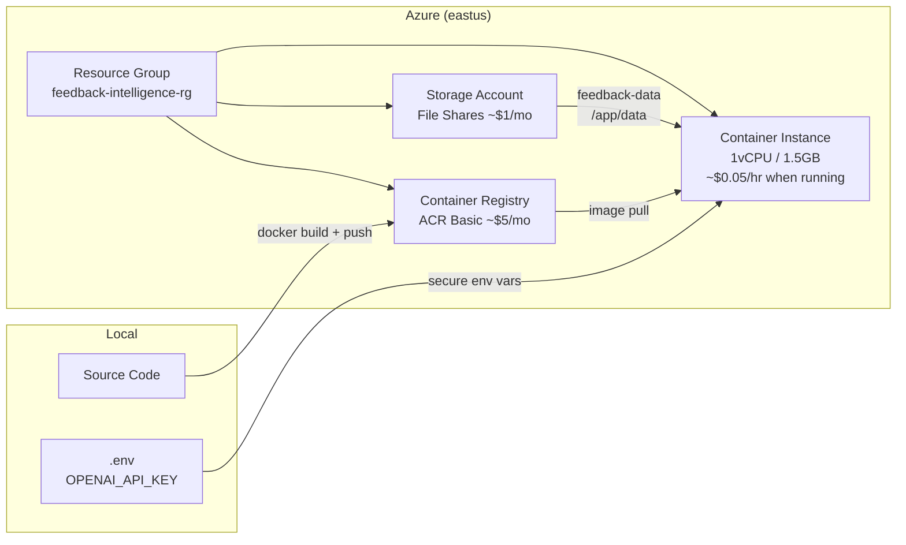
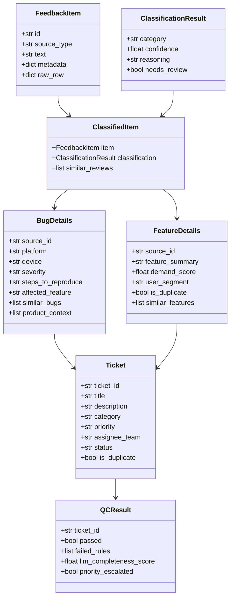

# Feedback Intelligence System

An agentic AI pipeline that transforms raw user feedback (app-store reviews, support emails) into structured engineering/product tickets — with RAG-enhanced analysis, duplicate detection, quality gates, and a full Streamlit analytics dashboard.

---

## Table of Contents

- [Overview](#overview)
- [Features](#features)
- [Architecture](#architecture)
  - [System Architecture](#system-architecture)
  - [LangGraph Pipeline](#langgraph-pipeline)
  - [Data Flow](#data-flow)
  - [RAG Flow](#rag-flow)
  - [UI Pages](#ui-pages)
- [Quick Start](#quick-start)
  - [Docker (recommended)](#docker-recommended)
  - [Local Development](#local-development)
  - [Azure Deployment](#azure-deployment)
- [Project Structure](#project-structure)
- [Configuration](#configuration)
- [Data Models](#data-models)
- [Testing](#testing)
- [Tech Stack](#tech-stack)

---

## Overview

The Feedback Intelligence System ingests CSV files containing app-store reviews and support emails, runs them through a 7-node LangGraph agentic pipeline powered by GPT-4o, and produces structured tickets enriched with RAG context from your product documentation.

```
Raw Feedback (CSV)  ──▶  7-Node AI Pipeline  ──▶  Structured Tickets (CSV + ChromaDB)
                                  │
                         Product Docs (RAG)
```

---

## Features

| Feature | Description |
|---|---|
| **Agentic Pipeline** | 7-node LangGraph state machine with conditional routing and parallel execution |
| **Structured LLM Output** | GPT-4o with Pydantic schema validation — 100% reliable JSON parsing |
| **Dual RAG** | Product docs (context) + past feedback (historical patterns) via ChromaDB |
| **Duplicate Detection** | Cosine similarity against ticket history, configurable threshold |
| **Quality Gates** | Rule-based validation + auto-escalation for crash/data-loss keywords |
| **5-Class Classification** | Bug · Feature Request · Praise · Complaint · Spam |
| **Streamlit UI** | 6-page dashboard: run pipeline, browse tickets, manage docs, analytics, config |
| **Docker Ready** | Single-image deployment with health checks and persistent volumes |
| **Metrics Tracking** | Per-run accuracy, category breakdown, QC pass rate, latency histogram |

---

## Architecture

### System Architecture



---

### LangGraph Pipeline

```mermaid
stateDiagram-v2
    [*] --> rag_loader
    rag_loader --> csv_reader : tech_doc_context loaded
    csv_reader --> classifier : feedback_items ready

    state fork <<fork>>
    classifier --> fork : classified_items

    fork --> bug_analyzer : category == Bug
    fork --> feature_extractor : category == Feature Request
    fork --> passthrough : Praise / Complaint / Spam

    state join <<join>>
    bug_analyzer --> join
    feature_extractor --> join
    passthrough --> join

    join --> ticket_creator
    ticket_creator --> quality_critic
    quality_critic --> [*]
```



---

### Data Flow



---

### RAG Flow



---

### UI Pages



| Page | Key Features |
|---|---|
| **Dashboard** | 4 KPI cards, category donut chart, source×category grouped bar, priority distribution, recent 20 tickets, run history |
| **Run Pipeline** | CSV file override, dry-run toggle, background thread execution, live progress bar, processing log tail, error display |
| **Tickets** | Filter by category/priority/status/keyword, inline edit form, Approve All, CSV export, duplicate badges |
| **Tech Docs** | Upload .md/.txt/.rst, re-index ChromaDB, tabbed browser (built-in vs uploaded), preview, delete, RAG query tester |
| **Analytics** | Tickets/run trend, category mix over time, QC pass rate, classification accuracy vs expected, confusion table, feature demand ranking, latency histogram |
| **Configuration** | Model selector, temperature, classification/duplicate thresholds, batch size, directory paths, save/reset |

---

## Quick Start

### Docker (recommended)

```bash
# 1. Clone and enter project
cd CapstoneProject-V1

# 2. Configure environment
cp .env.example .env
# Edit .env — set OPENAI_API_KEY=sk-proj-...

# 3. Build and run (first run ~3-5 min)
docker-compose up --build

# 4. Open UI
open http://localhost:8502
```

Subsequent runs (no code changes):
```bash
docker-compose up
```

Run the CLI pipeline only:
```bash
docker-compose run --rm app python -m src.main
```

---

### Local Development

**Prerequisites:** Python 3.11+

```bash
# 1. Create virtual environment
python -m venv venv
source venv/bin/activate        # Windows: venv\Scripts\activate

# 2. Install dependencies
pip install -r requirements.txt

# 3. Configure environment
cp .env.example .env
# Edit .env — set OPENAI_API_KEY=sk-proj-...

# 4. Run Streamlit UI
streamlit run ui/app.py

# 5. Or run CLI pipeline
python -m src.main

# 6. Run tests
python -m pytest tests/ -v
```

---

### Azure Deployment

The included `deployment.sh` deploys to **Azure Container Instances** — the cheapest Azure option (pay-per-second, zero cost when stopped).



**Estimated cost:**

| Scenario | Cost/month |
|---|---|
| Running 8 hrs/day | ~$18 |
| Running 24/7 | ~$46 |
| Stopped (idle) | ~$6 (ACR + Storage only) |

**Commands:**

```bash
# Pre-requisites
az login
cp .env.example .env       # fill in OPENAI_API_KEY

# First deploy (creates all Azure resources ~5 min)
./deployment.sh deploy

# Daily usage
./deployment.sh start      # start  → billing resumes
./deployment.sh stop       # stop   → compute billing paused
./deployment.sh status     # check state + URL
./deployment.sh logs       # tail live logs
./deployment.sh open       # open app in browser

# Update after code change
./deployment.sh update     # rebuild image + redeploy

# Teardown
./deployment.sh destroy    # delete all Azure resources
```

**App will be available at:**
```
http://feedback-intel.<region>.azurecontainer.io:8501
```

> Change `DNS_LABEL`, `RESOURCE_GROUP`, `LOCATION` at the top of `deployment.sh` before first deploy.

---

## Project Structure

```
CapstoneProject-V1/
├── Dockerfile                    # Single-stage python:3.11-slim image
├── docker-compose.yml            # Port 8502, volumes for data/ and docs/
├── requirements.txt              # Python dependencies
├── .env.example                  # Environment variable template
│
├── src/
│   ├── config.py                 # Centralised config (env → config.json)
│   ├── main.py                   # CLI entry point
│   ├── agents/
│   │   ├── rag_loader.py         # Index tech docs + warm-up RAG queries
│   │   ├── csv_reader.py         # Parse CSVs → FeedbackItem list
│   │   ├── classifier.py         # GPT-4o 5-class classification (batched)
│   │   ├── bug_analyzer.py       # Extract BugDetails with RAG context
│   │   ├── feature_extractor.py  # Extract FeatureDetails, detect duplicates
│   │   ├── ticket_creator.py     # Generate Ticket objects, write CSV
│   │   └── quality_critic.py     # Validate tickets, auto-escalate, metrics
│   ├── db/
│   │   └── chroma_store.py       # ChromaDB singleton (3 collections)
│   └── graph/
│       ├── state.py              # AgentState TypedDict + all Pydantic models
│       └── pipeline.py           # LangGraph StateGraph definition
│
├── ui/
│   ├── app.py                    # Streamlit entry point + landing page
│   ├── utils.py                  # Shared helpers: load/save CSV, cache
│   └── pages/
│       ├── 1_Dashboard.py        # KPIs and Plotly charts
│       ├── 2_Run_Pipeline.py     # Pipeline trigger and live logs
│       ├── 3_Tickets.py          # Ticket browser and editor
│       ├── 4_Tech_Docs.py        # RAG knowledge base management
│       ├── 5_Analytics.py        # Trends, accuracy, feature demand
│       └── 6_Configuration.py    # Settings panel
│
├── data/
│   ├── input/                    # Source CSVs (mounted volume in Docker)
│   ├── output/                   # Generated tickets, logs, metrics
│   └── chroma/                   # ChromaDB persistent storage
│
├── docs/
│   └── product/                  # Built-in product docs for RAG
│       └── user_uploads/         # User-uploaded docs via UI
│
├── scripts/
│   └── generate_mock_data.py     # Generate test CSVs
│
└── tests/
    └── unit/
        └── test_graph_skeleton.py  # 18 unit tests (all passing)
```

---

## Configuration

All settings can be tuned via the **Configuration** page in the UI or by editing `.env` / `config.json`.

| Variable | Default | Description |
|---|---|---|
| `OPENAI_API_KEY` | _(required)_ | OpenAI API key |
| `OPENAI_MODEL` | `gpt-4o` | LLM model for all agents |
| `OPENAI_TEMPERATURE` | `0.0` | Sampling temperature |
| `CHROMA_PATH` | `./data/chroma` | ChromaDB persistence directory |
| `DATA_DIR` | `./data/input` | Directory for input CSVs |
| `OUTPUT_DIR` | `./data/output` | Directory for output CSVs |
| `TECH_DOCS_DIR` | `./docs/product` | Product docs directory for RAG |
| `CLASSIFICATION_THRESHOLD` | `0.7` | Minimum confidence to accept classification |
| `DUPLICATE_SIMILARITY_THRESHOLD` | `0.85` | Cosine similarity threshold for duplicate detection |
| `CLASSIFIER_BATCH_SIZE` | `10` | Items per GPT-4o classification call |

**Priority:** `config.json` overrides `.env` overrides defaults.

---

## Data Models



---

## Testing

```bash
# Run all tests
python -m pytest tests/ -v

# Run with coverage
python -m pytest tests/ --cov=src --cov-report=term-missing
```

**Current status: 18/18 tests passing**

Key test scenarios covered:

| Test | Description |
|---|---|
| `test_graph_compiles` | StateGraph builds without errors |
| `test_agent_state_has_all_fields` | All required state fields present |
| `test_route_single_category[*]` | Conditional routing for all 5 categories |
| `test_route_prefers_bug_in_mixed_batch` | Bug takes priority in mixed batches |
| `test_stub_graph_traverses_end_to_end` | Full pipeline run with mocked ChromaDB/OpenAI |
| `test_classification_confidence_clamped_*` | Confidence values clamped to 0–1 |
| `test_bug_details_*` | BugDetails field validation |
| `test_feature_demand_score_*` | Demand score range validation |
| `test_qc_escalation_keywords` | Auto-escalation on crash/data-loss keywords |
| `test_log_entries_accumulate_across_nodes` | Log accumulation via `operator.add` |

---

## Tech Stack

| Layer | Technology |
|---|---|
| **LLM** | OpenAI GPT-4o — structured outputs via `beta.chat.completions.parse` |
| **Agentic Framework** | LangGraph `StateGraph` with typed state and conditional edges |
| **Vector Database** | ChromaDB — persistent, cosine similarity, `text-embedding-3-small` |
| **UI** | Streamlit 1.40+ — multi-page, background threads, `st.cache_data` |
| **Charts** | Plotly Express — donut, grouped bar, line, histogram |
| **Data** | Pandas 2.2+, Pydantic v2 |
| **Containerisation** | Docker (python:3.11-slim), Docker Compose |
| **Testing** | pytest, pytest-mock |
| **Config** | python-dotenv + JSON config overlay |
