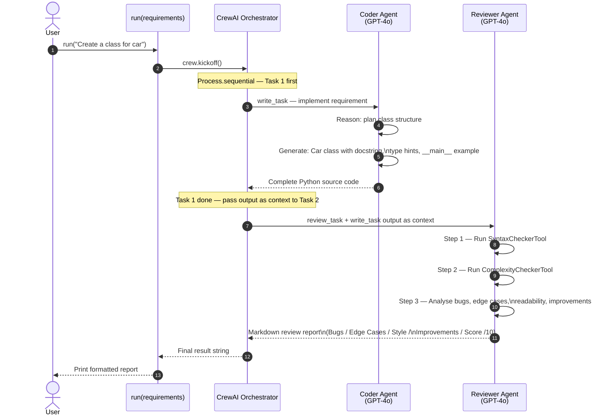
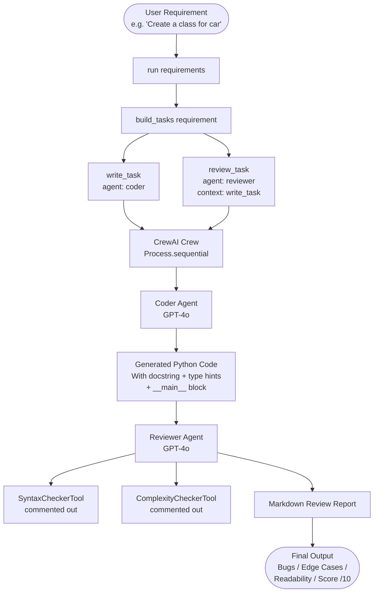

# CrewAI — Python Code Review Pipeline

A two-agent **CrewAI** workflow that takes a plain-English requirement, generates working Python code, and produces a structured markdown code-review report — all powered by **GPT-4o**.

---

## Files

| File | Description |
|---|---|
| `app.py` | Main entry point — defines agents, tasks, crew, and `run()` function |
| `requirements.txt` | Python dependencies |

---

## Agents

### `coder` — Python Developer

| Property | Value |
|---|---|
| Role | Python Developer |
| Goal | Write clean, working Python code that fulfils the given requirement |
| LLM | `gpt-4o` |
| Delegation | Disabled |
| Backstory | Senior Python developer — PEP-8, docstrings, readable structure |

### `reviewer` — Code Reviewer

| Property | Value |
|---|---|
| Role | Code Reviewer |
| Goal | Review code for bugs, edge cases, readability, and improvements |
| LLM | `gpt-4o` |
| Delegation | Disabled |
| Tools | `SyntaxCheckerTool`, `ComplexityCheckerTool` *(currently commented out)* |
| Backstory | 10+ years Python experience — correctness, style, maintainability |

---

## Tasks

### `write_task`
- **Agent:** `coder`
- **Input:** Plain-English requirement string
- **Instructions:** Implement the requirement with docstring, type hints, and a `__main__` usage example
- **Expected Output:** Complete, runnable Python source code

### `review_task`
- **Agent:** `reviewer`
- **Context:** Output of `write_task` (reviewer sees the generated code)
- **Steps:**
  1. Run Syntax Checker tool
  2. Run Complexity Checker tool
  3. Write structured review covering Bugs, Edge Cases, Readability, Improvements, Score
- **Expected Output:** Structured markdown report with an overall score out of 10

---

## Crew Configuration

```python
Crew(
    agents=[coder, reviewer],
    tasks=[write_task, review_task],
    process=Process.sequential,
    verbose=True,
)
```

| Parameter | Value | Meaning |
|---|---|---|
| `process` | `sequential` | Tasks run one after another in order |
| `verbose` | `True` | Prints each agent's reasoning to console |

---

## Sequence Diagram



---

## Agent Interaction Flowchart



---

## Review Report Structure

The reviewer produces a markdown report with these sections:

```
## BUGS / ERRORS
...

## EDGE CASES not handled
...

## READABILITY & STYLE
...

## SUGGESTED IMPROVEMENTS
...code snippets...

## OVERALL SCORE
X / 10
```

---

## Setup & Run

```bash
# 1 — Install dependencies
pip install -r requirements.txt

# 2 — Set your OpenAI key
echo OPENAI_API_KEY=sk-... > .env

# 3 — Run with the default example ("Create a class for car")
python app.py
```

### Run with a custom requirement

```python
from app import run

report = run("Write a function that merges two sorted lists")
print(report)
```

---

## Key Behaviours

- **Sequential pipeline** — coder always runs before reviewer; reviewer always sees the generated code
- **Context passing** — `review_task` has `context=[write_task]`, so CrewAI automatically feeds the coder's output to the reviewer
- **No delegation** — both agents have `allow_delegation=False`, keeping responsibilities clearly separated
- **Tool stubs ready** — `SyntaxCheckerTool` and `ComplexityCheckerTool` are referenced in `review_task` description but commented out in the agent definition; uncomment to activate
- **Extensible** — add more agents (e.g. a `tester` to write unit tests) and more tasks to the sequential chain

---

## Extending the Pipeline

To add a **unit test writer** stage:

```python
tester = Agent(role="Test Engineer", goal="Write pytest unit tests", llm="gpt-4o", ...)

test_task = Task(
    description="Write pytest unit tests for the reviewed code.",
    expected_output="pytest test file covering happy path and edge cases.",
    agent=tester,
    context=[write_task, review_task],
)

crew = Crew(agents=[coder, reviewer, tester], tasks=[write_task, review_task, test_task], ...)
```
