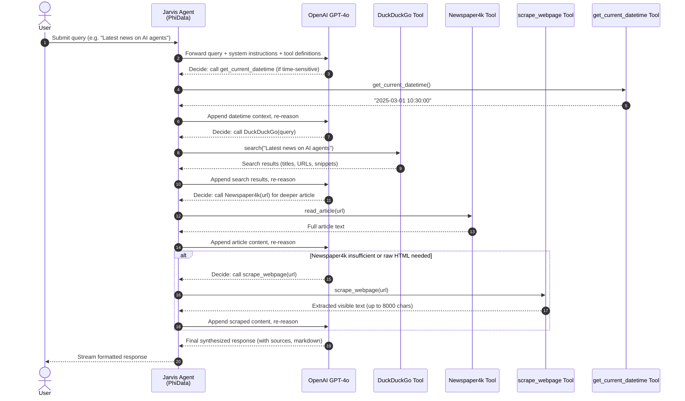
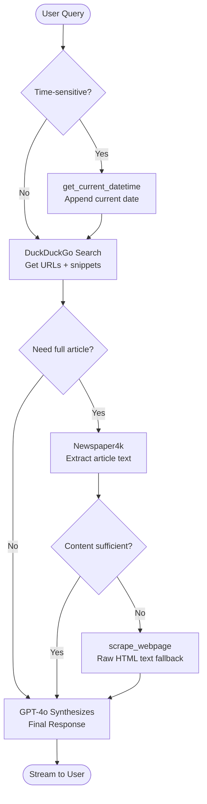

# Demo PhiData — Agent with Web Search

A PhiData-powered research agent ("Jarvis") that combines **DuckDuckGo search**, **article scraping**, and **custom webpage fetching** to answer queries with cited, up-to-date information.

## Files

| File | Description |
|---|---|
| `Agent_with_WebSearch` | Main agent with 4 tools: DuckDuckGo, Newspaper4k, scrape_webpage, get_current_datetime |
| `basic.py` | Minimal conversational agent (no tools) |
| `finance_agent.py` | Finance-focused agent for analyst recommendations |
| `Requirement.txt` | Python dependencies |

## Agent Architecture

The agent uses **GPT-4o** as the reasoning model and selects tools dynamically based on the query.

### Tools

| Tool | Type | Purpose |
|---|---|---|
| `DuckDuckGo` | PhiData built-in | Web search — returns links and snippets |
| `Newspaper4k` | PhiData built-in | Full article extraction from URLs |
| `scrape_webpage` | Custom Python fn | Raw HTML-to-text scraper (fallback) |
| `get_current_datetime` | Custom Python fn | Returns current date/time for time-sensitive queries |

---

## Sequence Diagram — Agent with Web Search



---

## Tool Decision Logic



---

## Setup

```bash
# Install dependencies
pip install -r Requirement.txt

# Set OpenAI key
echo OPENAI_API_KEY=sk-... > .env

# Run the web search agent
python Agent_with_WebSearch

# Run the basic agent
python basic.py
```

## Key Behaviors

- **Streaming output** — responses print token-by-token via `stream=True`
- **Tool call visibility** — `show_tool_calls=True` prints each tool invocation
- **Markdown output** — responses are formatted with headers and bullet points
- **Context safety** — `scrape_webpage` truncates content to 8000 chars to protect the LLM context window
