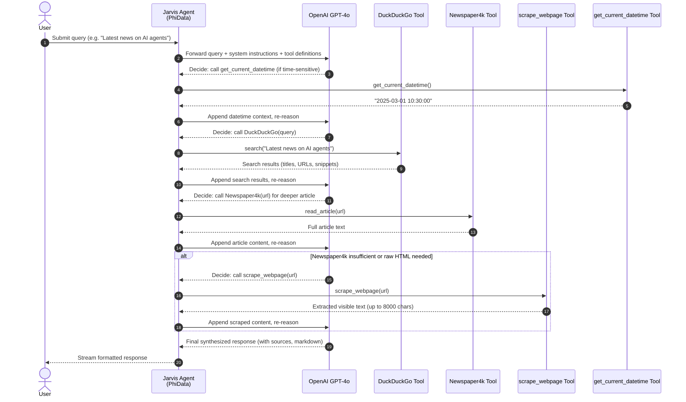
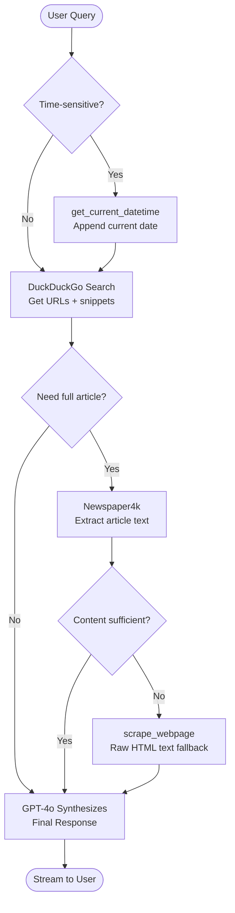
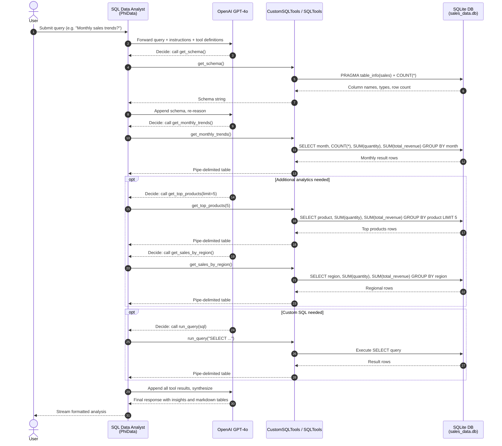
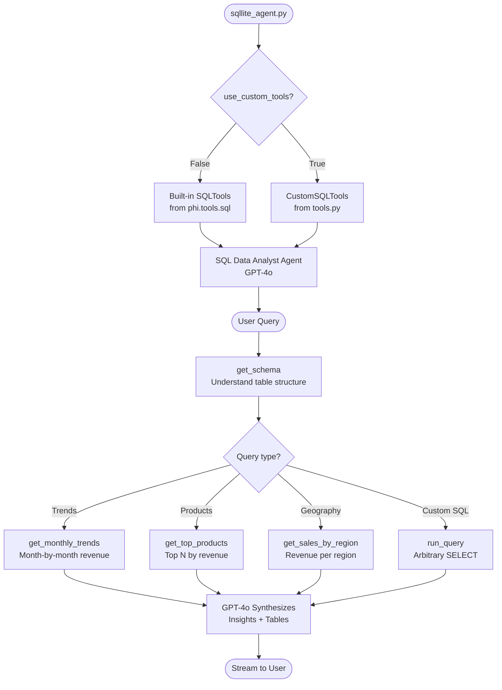

# Demo PhiData — Agent with Web Search

A PhiData-powered research agent ("Jarvis") that combines **DuckDuckGo search**, **article scraping**, and **custom webpage fetching** to answer queries with cited, up-to-date information.

## Files

| File | Description |
|---|---|
| `Agent_with_WebSearch.py` | Web research agent with 4 tools: DuckDuckGo, Newspaper4k, scrape_webpage, get_current_datetime |
| `sqllite_agent.py` | SQL analyst agent — queries a SQLite sales database using built-in or custom tools |
| `tools.py` | `CustomSQLTools` PhiData toolkit with 5 analytics methods |
| `create_sqlite.py` | Generates `sales_data.csv` and loads it into `data/sales_data.db` |
| `basic.py` | Minimal conversational agent (no tools) |
| `finance_agent.py` | Finance-focused agent for analyst recommendations |
| `Requirement.txt` | Python dependencies |

## Agent Architecture

The agent uses **GPT-4o** as the reasoning model and selects tools dynamically based on the query.

### Tools

| Tool | Type | Purpose |
|---|---|---|
| `DuckDuckGo` | PhiData built-in | Web search — returns links and snippets |
| `Newspaper4k` | PhiData built-in | Full article extraction from URLs |
| `scrape_webpage` | Custom Python fn | Raw HTML-to-text scraper (fallback) |
| `get_current_datetime` | Custom Python fn | Returns current date/time for time-sensitive queries |

---

## Sequence Diagram — Agent with Web Search


```mermaid
sequenceDiagram
    autonumber
    actor User
    participant Agent as Jarvis Agent<br/>(PhiData)
    participant LLM as OpenAI GPT-4o
    participant DDG as DuckDuckGo Tool
    participant N4K as Newspaper4k Tool
    participant SW as scrape_webpage Tool
    participant DT as get_current_datetime Tool

    User->>Agent: Submit query (e.g. "Latest news on AI agents")

    Agent->>LLM: Forward query + system instructions + tool definitions

    LLM-->>Agent: Decide: call get_current_datetime (if time-sensitive)

    Agent->>DT: get_current_datetime()
    DT-->>Agent: "2025-03-01 10:30:00"

    Agent->>LLM: Append datetime context, re-reason

    LLM-->>Agent: Decide: call DuckDuckGo(query)

    Agent->>DDG: search("Latest news on AI agents")
    DDG-->>Agent: Search results (titles, URLs, snippets)

    Agent->>LLM: Append search results, re-reason

    LLM-->>Agent: Decide: call Newspaper4k(url) for deeper article

    Agent->>N4K: read_article(url)
    N4K-->>Agent: Full article text

    Agent->>LLM: Append article content, re-reason

    alt Newspaper4k insufficient or raw HTML needed
        LLM-->>Agent: Decide: call scrape_webpage(url)
        Agent->>SW: scrape_webpage(url)
        SW-->>Agent: Extracted visible text (up to 8000 chars)
        Agent->>LLM: Append scraped content, re-reason
    end

    LLM-->>Agent: Final synthesized response (with sources, markdown)

    Agent-->>User: Stream formatted response
```

---

## Tool Decision Logic


```mermaid
flowchart TD
    Q([User Query]) --> A{Time-sensitive?}
    A -- Yes --> DT[get_current_datetime\nAppend current date]
    A -- No --> S
    DT --> S[DuckDuckGo Search\nGet URLs + snippets]
    S --> D{Need full article?}
    D -- Yes --> N4K[Newspaper4k\nExtract article text]
    D -- No --> R
    N4K --> F{Content sufficient?}
    F -- Yes --> R[GPT-4o Synthesizes\nFinal Response]
    F -- No --> SW[scrape_webpage\nRaw HTML text fallback]
    SW --> R
    R --> U([Stream to User])
```

---

## Setup

```bash
# Install dependencies
pip install -r Requirement.txt

# Set OpenAI key
echo OPENAI_API_KEY=sk-... > .env

# Run the web search agent
python Agent_with_WebSearch.py

# Run the basic agent
python basic.py
```

## Key Behaviors

- **Streaming output** — responses print token-by-token via `stream=True`
- **Tool call visibility** — `show_tool_calls=True` prints each tool invocation
- **Markdown output** — responses are formatted with headers and bullet points
- **Context safety** — `scrape_webpage` truncates content to 8000 chars to protect the LLM context window

---

---

# SQLite Agent

A PhiData-powered SQL analyst agent ("SQL Data Analyst") that queries a **SQLite sales database** using either PhiData's built-in `SQLTools` or a custom `CustomSQLTools` toolkit.

## SQLite Files

| File | Description |
|---|---|
| `sqllite_agent.py` | Agent entry point — picks built-in or custom tools via `use_custom_tools` flag |
| `tools.py` | `CustomSQLTools` — custom PhiData `Toolkit` with 5 registered analytics methods |
| `create_sqlite.py` | `CSVToSQLite` — creates `sales_data.csv` and loads it into SQLite with indexes |
| `data/sales_data.csv` | 50-row sales dataset (generated by `create_sqlite.py`) |
| `data/sales_data.db` | SQLite database with `sales` table and 4 performance indexes |

## Database Schema

**Table: `sales`** (50 rows)

| Column | Type | Description |
|---|---|---|
| `transaction_id` | INTEGER | Unique transaction ID |
| `date` | TEXT | Transaction date (YYYY-MM-DD) |
| `product` | TEXT | Product name (Laptop, Smartphone, etc.) |
| `category` | TEXT | Electronics or Accessories |
| `quantity` | INTEGER | Units sold |
| `unit_price` | REAL | Price per unit |
| `region` | TEXT | North / South / East / West |
| `salesperson` | TEXT | Alice / Bob / Charlie / Diana |
| `customer_type` | TEXT | Business or Consumer |
| `total_revenue` | REAL | quantity × unit_price |
| `month` | TEXT | Year-month string (YYYY-MM) |

**Indexes:** `date`, `product`, `region`, `salesperson`

## CustomSQLTools — Registered Methods

| Method | Description |
|---|---|
| `get_schema()` | Lists all tables, columns, types, and row counts |
| `run_query(query)` | Executes a SELECT query and returns pipe-delimited results |
| `get_top_products(limit)` | Top N products ranked by total revenue |
| `get_sales_by_region()` | Revenue and units sold per region |
| `get_monthly_trends()` | Month-by-month transaction count, units, and revenue |

> `run_query` only allows `SELECT` statements — write operations are blocked for safety.

---

## Sequence Diagram — SQLite Agent


```mermaid
sequenceDiagram
    autonumber
    actor User
    participant Agent as SQL Data Analyst<br/>(PhiData)
    participant LLM as OpenAI GPT-4o
    participant Tools as CustomSQLTools / SQLTools
    participant DB as SQLite DB<br/>(sales_data.db)

    User->>Agent: Submit query (e.g. "Monthly sales trends?")

    Agent->>LLM: Forward query + instructions + tool definitions

    LLM-->>Agent: Decide: call get_schema()

    Agent->>Tools: get_schema()
    Tools->>DB: PRAGMA table_info(sales) + COUNT(*)
    DB-->>Tools: Column names, types, row count
    Tools-->>Agent: Schema string

    Agent->>LLM: Append schema, re-reason

    LLM-->>Agent: Decide: call get_monthly_trends()

    Agent->>Tools: get_monthly_trends()
    Tools->>DB: SELECT month, COUNT(*), SUM(quantity), SUM(total_revenue) GROUP BY month
    DB-->>Tools: Monthly result rows
    Tools-->>Agent: Pipe-delimited table

    opt Additional analytics needed
        LLM-->>Agent: Decide: call get_top_products(limit=5)
        Agent->>Tools: get_top_products(5)
        Tools->>DB: SELECT product, SUM(quantity), SUM(total_revenue) GROUP BY product LIMIT 5
        DB-->>Tools: Top products rows
        Tools-->>Agent: Pipe-delimited table

        LLM-->>Agent: Decide: call get_sales_by_region()
        Agent->>Tools: get_sales_by_region()
        Tools->>DB: SELECT region, SUM(quantity), SUM(total_revenue) GROUP BY region
        DB-->>Tools: Regional rows
        Tools-->>Agent: Pipe-delimited table
    end

    opt Custom SQL needed
        LLM-->>Agent: Decide: call run_query(sql)
        Agent->>Tools: run_query("SELECT ...")
        Tools->>DB: Execute SELECT query
        DB-->>Tools: Result rows
        Tools-->>Agent: Pipe-delimited table
    end

    Agent->>LLM: Append all tool results, synthesize

    LLM-->>Agent: Final response with insights and markdown tables

    Agent-->>User: Stream formatted analysis
```

---

## Tool Selection Flowchart


```mermaid
flowchart TD
    Start([sqllite_agent.py]) --> Flag{use_custom_tools?}

    Flag -- False --> BT[Built-in SQLTools\nfrom phi.tools.sql]
    Flag -- True --> CT[CustomSQLTools\nfrom tools.py]

    BT --> Agent[SQL Data Analyst Agent\nGPT-4o]
    CT --> Agent

    Agent --> Q([User Query])
    Q --> S1[get_schema\nUnderstand table structure]
    S1 --> S2{Query type?}

    S2 -- Trends --> MT[get_monthly_trends\nMonth-by-month revenue]
    S2 -- Products --> TP[get_top_products\nTop N by revenue]
    S2 -- Geography --> RG[get_sales_by_region\nRevenue per region]
    S2 -- Custom SQL --> RQ[run_query\nArbitrary SELECT]

    MT --> Synth[GPT-4o Synthesizes\nInsights + Tables]
    TP --> Synth
    RG --> Synth
    RQ --> Synth

    Synth --> U([Stream to User])
```

---

## SQLite Setup & Run

```bash
# Step 1 — Generate the database (only needed once)
cd Demo_PhiData
python create_sqlite.py

# Step 2 — Run agent with built-in SQLTools (default)
python sqllite_agent.py

# Step 3 — Run agent with CustomSQLTools
# Edit sqllite_agent.py line 75:
#   agent = create_sql_agent(str(db_path), use_custom_tools=True)
python sqllite_agent.py
```

## SQLite Key Behaviors

- **Dual tool mode** — switch between PhiData `SQLTools` and `CustomSQLTools` with one flag
- **Schema-first** — agent is instructed to always call `get_schema` before querying
- **SELECT-only safety** — `run_query` rejects any non-SELECT statement
- **Absolute DB path** — `Path(__file__).parent / "data" / "sales_data.db"` ensures the DB is found regardless of working directory
- **Debug mode** — `debug_mode=True` prints full PhiData reasoning trace to console
